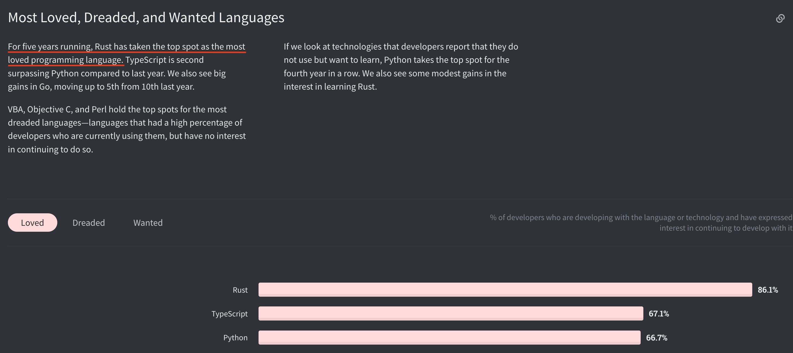

## An Introductory Tour of Rust
<!-- .element height="50%" width="50%" -->

Richard Gibson | @rickityg | Hexlabs.io

---

## Rust: A Loved language


---

## About Rust
- Primarily a systems programming language
- Started at Mozilla
- Used extensively at Amazon, Google & Microsoft
- Used in Firefox, Deno and Firecracker 

----

## About Rust
- Compiled language
- Runs natively without runtime
- No Garbage Collection 
- Performance on par with C
- Strong static typing 
- Imperative with FP & OOP Features

----

## About Rust
Compiler/Type system ensures
- Incorrect Memory (De)allocation
- No surprises with types 
    - (no null or thrown exceptions)
- No race conditions across threads

---

## Rust Community
- Rust foundation 
    - community driven with industry support
- Open RFC process
- Documentation encouraged
- Great free learning resources
- Inclusive culture

---

## Rust Tooling

- cargo: build and dependencies
- clippy: linter
- rustfmt: code formatter
- rustdoc: documentation
- excellent editor support
- compiler with sane error messages!!!

---

## Setup

Linux or MacOS
```bash
$ curl --proto '=https' --tlsv1.2 https://sh.rustup.rs -sSf | sh
```

```bash
Rust is installed now. Great!
```

[Other instructions available in Rust book](https://doc.rust-lang.org/book/ch01-01-installation.html)
----

## Cargo

Default build tool installed with Rust

```bash [1|3,4|8,9|11,14]
cargo new dev_bash --bin # --bin for program, --lib for library

cd dev_bash/
cargo build # fetches dependencies, uses profile `dev`
Compiling dev_bash v0.1.0 (.../dev_bash)
Finished dev [unoptimized + debuginfo] target(s) in 0.75s

./target/debug/dev_bash
Hello, world!

cargo run                                                 
Finished dev [unoptimized + debuginfo] target(s) in 0.00s
Running `target/debug/dev_bash`
Hello, world!

```

----

## Other useful cargo commands

`cargo test` - Compile and execute tests </br>
`cargo fetch` - Fetch dependencies of a package </br>
`cargo tree` - Display dependency graph </br>
`cargo search` - Search packages in crates.io </br>
`cargo fmt` - Format code files using rustfmt </br>
`cargo help` - explain cargo command
<!-- .element align="left" -->
----

## Cargo package management

- Cargo dependency management
- Binarys available from a central registry
- Code can be built from git repo or local path
- RustDoc comments become documentation for crate on registry

---

## Rust Language basics

----

## Variables

Optional explicit types otherwise implicit
```rust
    let i = 1000;
    let j: i32 = 1000;
```
```rust 
    let box_i = Box::new(1);
    let z = *b + 1;
```
----

## Default Immutability

```rust
    let mut i = 1000;
    let j = 1000;
    i +=1;
    j +=1;
```

```bash
error[E0384]: cannot assign twice to immutable variable `j`
  --> src/main.rs:11:5
   |
9  |     let j = 1000;
   |         -
   |         |
   |         first assignment to `j`
   |         help: make this binding mutable: `mut j`
10 |     i +=1;
11 |     j +=1;
   |     ^^^^^ cannot assign twice to immutable variable
```
----

## Default Immutable structures

```rust
    let mut mut_vec = Vec::new();
    mut_vec.push("some value");

    let immut_vec = Vec::new();
    immut_vec.push("another value");
```


```bash
error[E0596]: cannot borrow `immut_vec` as mutable, as it is not declared as mutable
  --> src/main.rs:15:5
   |
14 |     let immut_vec = Vec::new();
   |         --------- help: consider changing this to be mutable: `mut immut_vec`
15 |     immut_vec.push("another value");
   |     ^^^^^^^^^ cannot borrow as mutable
```


----

## Function syntax

```rust
fn square_then_add(i: i32, j: i32) -> i32 {
    let i_sq = i * i;
    let j_sq = j * j;
    i_sq + j_sq
}
```
```rust
fn square_then_add_then_print(i: i32, j: i32) {
    let i_sq = i * i;
    let j_sq = j * j;
    println!("square & sum of ({},{}) is {}", i, j, i_sq + j_sq);
}
```

---

## Ownership: Rusts memory management

Garbage (memory no longer used) must be cleaned up<!-- .element align="left" -->
- Explicitly through code
- Implicitly through a garbage collector

----

## Ownership: Rusts memory management

Rust enforces memory safety at Compile time through ownership<!-- .element align="left" -->
- Memory is cleaned up as a reference goes out of scope
- Strict rules on references to ensure scoping is correct

Same technique used for files and connections
<!-- .element align="left" -->

----

## Ownership: Example

```rust 
    // s owner of string
    let s = String::from("hello");
    // transfer ownership to y
    let y = s;
    // data no longer held at s
    println!("{}, world!", s);
```

```bash
error[E0382]: borrow of moved value: `s`
  --> src/main.rs:43:28
   |
41 |     let s = String::from("hello");
   |         - move occurs because `s` has type `String`, which does not implement the `Copy` trait
42 |     let _y = s;
   |              - value moved here
43 |     println!("{}, world!", s);
   |                            ^ value borrowed here after move
```

----

## Ownership: Rules

- One owner of each piece of data
- Data cleaned up when owner goes out of scope
- Owner can transfer ownership to a piece of data or lend it out

----

## Ownership: Example fixed

```rust 
    let s = String::from("hello");
    //give y a read only reference of s
    let y = &s;
    println!("{}, world!", s);

    //hello, world!
```


- Unlimited number of immutable references / readers
- Only one mutable reference &mut T allowed
- Reference Counting structures also available
s
---

## Structs

```rust
#[derive(Debug, PartialEq, Eq)]
 struct Person {
    name: String,
    age: u32,
}

println!("person: {:?}", Person {
        name: String::from("bob"),
        age: 23,
    });
```

```bash
person: Person { name: "bob", age: 23 }
```
----

## Enumerations

```rust
enum PC {
    RED,
    GREEN,
    BLUE,
}

let j: u32 = match colour {
    PC::RED => 1,
    PC::GREEN | PC::BLUE => 0,
}
// must be exhaustive `_` used as wildcard
let i: u32 = match colour {
    PC::RED => 1,
    _ => 0
}

```

----

## Option

Enumerations can hold data, A.K.A algebraic data types
```rust

enum Option<T> {
    None,
    Some(T),
}

```

----

## Result
```rust

enum Result<T, E> {
    Ok(T),
    Err(E),
}
```

----

## Option and Result pattern matching

```rust 
let o1 = Some(1);
match o1 {
    // compiler recognises `i` as i32
    Some(i) => println!("value {} present", i),
    None => println!("empty")
};
```


```rust 

 match r1 {
        Ok(i) => println!("success with value {}", i),
        Err(e) => println!("{}", e)
    }

//also
if let &Ok(i ) = &r1 { 
    println!("success with value {}", i)
}
```

----

## Option and Result ? syntax
```rust 
fn combine(o1: Option<i32>, o2: Option<i32>) -> Option<i32> {
    let i: i32 = o1?;
    let j: i32 = o2?;
    Some(i + j)
}
```

```rust 
fn combine(r1: Result<i32, Error>,
           r2: Result<i32, Error>) -> Result<i32, Error> {
    let i: i32 = r1?;
    let j: i32 = r2?;
    Ok(i + j)
}
```

----

## Methods
Decorators for Structs and Enums

```rust
struct Person { name: String, age: u32 }
```

```rust
impl Person {
    fn to_csv(&self) -> String {
        format!("{},{}", self.name, self.age)
    }
    fn inc_age(&mut self) {
        self.age += 1;
    }
}
let mut person = Person {
        name: String::from("bob"),
        age: 23,
    };
```

```rust    
println!("{}", person.to_csv());
//bob,23
person.inc_age();
println!("{}", person.to_csv());
//bob,24

```


----

## Traits: Shared behaviours 
FP that looks like OOP
```rust
impl FromStr for Person {
    type Err = Box<dyn error::Error>;

    fn from_str(s: &str) -> Result<Self, Self::Err> {
        let person_info: Vec<&str> = s.split(",").collect();
        let name: String = String::from(person_info[0]);
        let age: u32 = person_info[1].parse()?;
        Ok(Person { name: name, age: age })
    }
}
```
```rust
println!("{:?}", "Fred,32".parse::<Person>());
//Ok(Person { name: "Fred", age: 32 })
println!("{:?}", "Fred,ZZZ".parse::<Person>());
//Err(ParseIntError { kind: InvalidDigit })
```

----

## Other great language features
- Concurrency libraries
- Macro System

---

## A Loved language
- Modern tools for system programmers
- Memory/Concurrency safety
- "Zero-cost" abstractions
- Thoughtful Interoperability 
    - FFI with other languages 
    - Easy compilation for multiple platforms
- Active Community

---

## Resources

- [Rust Book](https://doc.rust-lang.org/book/)
- [Rust by Example](https://doc.rust-lang.org/stable/rust-by-example/)
- [Rust Youtube channel](https://www.youtube.com/channel/UCaYhcUwRBNscFNUKTjgPFiA)

